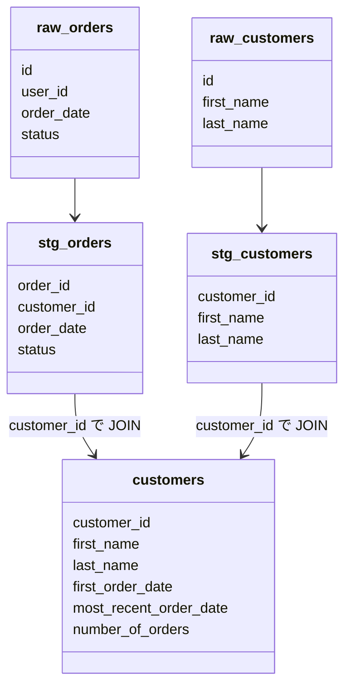

# qiita-dbt-osmosis-sample

Qiita 用サンプルコード。

## データリネージ

```mermaid
classDiagram
    class raw_orders {
        id
        user_id
        order_date
        status
    }

    class raw_customers {
        id
        first_name
        last_name
    }

    class stg_orders {
        order_id
        customer_id
        order_date
        status
    }

    class stg_customers {
        customer_id
        first_name
        last_name
    }

    class customers {
        customer_id
        first_name
        last_name
        first_order_date
        most_recent_order_date
        number_of_orders
    }

    %%

    raw_orders --> stg_orders
    raw_customers --> stg_customers
    stg_orders --> customers : customer_id で JOIN
    stg_customers --> customers : customer_id で JOIN
```
